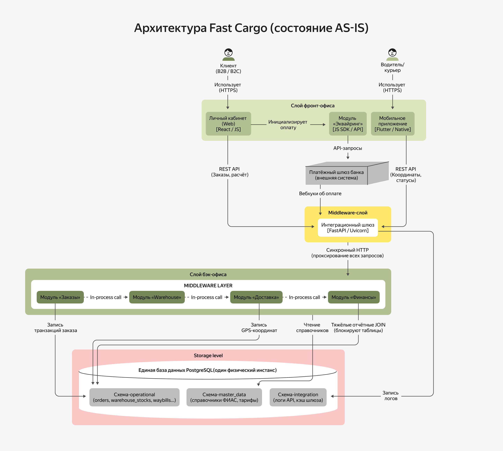

В этом спринте вы будете работать над кейсом логистической компании Fast Cargo. Она специализируется на перевозке мелкогабаритных грузов, а также предоставляет услуги выкупа и карго-доставки из Китая.

### О компании

Fast Cargo работает по принципу комплексного аутсорсинга, полностью заменяя клиенту собственный отдел логистики, склады и автопарк.

Компания принимает груз от отправителя, проверяет сопроводительные документы и оформляет накладные, после чего размещает товары на собственных складах, ведёт их учёт и следит за оптимальным использованием складских площадей.  Прежде чем груз отправится в путь, проводится его комплектация и маркировка, производится контроль весогабаритных характеристик и подготовка к транспортировке.

На этапе доставки специалисты Fast Cargo формируют оптимальный маршрутный лист и передают его курьеру или водителю, который физически доставляет груз до двери получателя. Всё это время компания  контролирует статус груза на каждом этапе пути, а по завершении доставки оформляет закрывающие документы для контрагентов.

#### Структура компании

У Fast Cargo классическая линейно-функциональная структура распределения зон ответственности:
- ИТ-отдел занимается проектированием и разработкой ИТ-ландшафта, обеспечением его бесперебойной работы и защитой корпоративных данных. Команда состоит из техлида, группы разработки, аналитиков, тестировщика и инженера эксплуатации. Техлид работает в компании со дня основания. Под его руководством спроектированы архитектура, стек и основной легаси-код.
- Отдел продаж отвечает за поиск новых клиентов и обработку входящих заявок (лидов).
- На отделе логистики лежит физическое и документальное перемещение товаров от поставщика к конечному клиенту с минимальными издержками.

Остальные виды деятельности (бухгалтерию, юриспруденцию и транспорт) Fast Cargo делегирует внешним подрядчикам или автоматизирует с помощью облачных сервисов.

#### Текущий ИТ-ландшафт

Fast Cargo годами развивалась как независимый бизнес, фокусируясь на операционной скорости. ИТ-ландшафт представляет собой трехслойную структуру:
- Фронт-офис — витрина логистических услуг и точка общения с отправителями и получателями. Здесь создаются и отслеживаются заказы, а также рассчитывается стоимость их доставки.
- Бэк-офис — сервисный уровень, где сконцентрировано ядро логистики, в чатсности ведется учёт складских остатков, процессинг заказов и формирование счетов.
- Middleware — интеграционный уровень для обмена данными между фронт- и бэк-офисом.

| Слой          | Компонент / система                                                                                                                                                                                                                                                                                                                                                                                                                                                                                                                                                                              |
|---------------|--------------------------------------------------------------------------------------------------------------------------------------------------------------------------------------------------------------------------------------------------------------------------------------------------------------------------------------------------------------------------------------------------------------------------------------------------------------------------------------------------------------------------------------------------------------------------------------------------|
| Фронт-офис    | Представлен в виде отдельных веб- и мобильного приложений, которые обращаются к монолитному бэкенду через общий слой Backend for Frontend.   • Личный кабинет (веб): регистрация клиентов B2B/B2C, калькулятор стоимости, создание заявок (Россия и Китай), генерация накладных.  • Мобильное приложение: авторизация водителей, маршрутные листы, смена статусов доставки, сканирование штрихкодов, загрузка фотографий актов.  • Модуль эквайринга: приём оплаты (карта/СБП) на сайте (предоплата) или через QR-код у курьера (наложенный платёж), фискализация чеков в ОФД. |
| Middleware    | Самописный интеграционный шлюз, который работает на Python (FastAPI/Uvicorn).  • Проксирование и маршрутизация трафика от фронтенд-приложений к монолитному бэкенду. Логирование входящих API-запросов и вебхуков от платёжного шлюза банка.                                                                                                                                                                                                                                                                                                                                               |
| Бэк-офис      | Реализован в виде монолитного бэкенда через Backend for Frontend. Логические модули внутри единой кодовой базы:  • Модуль «Заказы» отвечает за создание заказа из формы личного кабинета и валидацию документов.  • Модуль «Warehouse» фиксирует этапы приёма, хранения, сборки и готовности груза к отправке.- Модуль «Доставка» назначает курьеров, ведёт рейсы и фиксирует GPS-координаты.  • Модуль «Финансы» формирует счета, а также отслеживает статусы оплаты и закрывающие акты.                                                                                      |
| Storage level | Единая СУБД на базе PostgreSQL (один физический инстанс)  Логические схемы: 1. integration: таблицы логов API и кеша шлюза; 2. master_data: справочники адресов (ФИАС), тарифов, геозон и габаритов; 3. operational: бизнес-таблицы всех модулей монолита — orders, order_items, warehouse_stocks, waybills, invoices, где: • ORDERS — заказ на поставку от ритейлера, фиксируется в модуле «Заказы»; • DESADV — уведомление об отгрузке со склада, ‭фиксируется в модуле «Warehouse»; • INVOIC — счёт-фактура для оплаты, ‭фиксируется в модуле «Финансы».              |

 Текущее состояние архитектуры Fast Cargo

На схеме показана текущая архитектура Fast Cargo. Клиенты и курьеры работают через веб- и мобильные приложения, запросы проходят через интеграционный шлюз к модулям заказов, склада, доставки и финансов. Модули связаны синхронными вызовами и используют единую базу PostgreSQL, где хранятся операционные, справочные и интеграционные данные.

#### Предстоящая трансформация

В третьем квартале нынешнего года Fast Cargo получила предложение о слиянии со стороны крупнейшего ритейл-холдинга России «Продукты с душой». Партнёрство открывает выход на новые рынки и гарантирует десятикратный рост объёмов бизнеса. Ключевые условие сделки со стороны «Продуктов с душой» — глубокая интеграция ИТ-систем и адаптация технологического ландшафта Fast Cargo под целевые корпоративные стандарты.

Разрабатываемое архитектурное решение должно быть задокументировано и пройти последовательное согласование с профильными департаментами холдинга:

- Архитектурный штаб «Продуктов с душой» оценит системную целостность решения, а также проверит соответствие фреймворкам корпоративной архитектуры (TOGAF), отсутствие дублирования функций и обоснование выбора технологического стека (анализ преимуществ Open Source перед коммерческим ПО).
- Департамент информационной безопасности проверит на соответствие государственным и отраслевым стандартам (в частности, требованиям ФЗ-152 в отношении персональных данных клиентов и ГОСТов РФ) и проконтролирует изоляцию платёжных контуров.
- Производственно-инфраструктурный департамент определит утилизацию ресурсов действующих ЦОД, сформулирует инфраструктурные требования (On-Premise / Managed-облака) и запланирует бюджеты на эксплуатацию при пиковых нагрузках.
- Операционный блок проанализирует коммерческие риски переходного периода, оценит влияние изменений на непрерывность текущих операционных процессов и подтвердит планируемый экономический эффект (ROI).

#### Кросс-функциональные требования

Для успешной интеграции в ИТ-инфраструктуру «Продуктов с душой» Fast Cargo в течение года необходимо обеспечить поддержку трёх целевых систем.

Во-первых, это EDI (Electronic Data Interchange) — сквозной автоматический обмен коммерческими документами (ORDERS, INVOIC, DESADV) со всеми торговыми сетями холдинга в реальном времени с жёстким SLA.

Во-вторых, потребуется телематика и IoT — установка датчиков оперативного контроля на весь транспорт для непрерывного стриминга координат (GPS/ГЛОНАСС) и мониторинга состояния грузов.

Наконец, необходима омниканальная CRM-система поддержки — единый контур для чат-ботов и операторов, требующий мгновенного доступа к сквозной истории заказов, перемещений и профилей клиентов.

Архитектурный штаб холдинга настаивает, чтобы целевая архитектура соответствовала системным критериям.

**Критерий 1. Стабильность при обработке высоконагруженных потоковых данных (IoT)**

Требуется бесперебойная фиксация непрерывного потока координат от датчиков телематики с пиковой нагрузкой до трёх тысяч RPS на запись. Обязательные условия — временная деградация или плановые работы на модулях склада или биллинга не должны приводить к потере геоданных или замедлению создания заказов.

**Критерий 2. Консистентность данных в распределенной среде (EDI)**

Архитектура должна обеспечивать сквозную обработку цепочки коммерческих документов (ORDERS → DESADV → INVOIC) в реальном времени. При этом после разделения данных по доменам нельзя использовать распределённые блокировки СУБД и междоменные JOIN-запросы. Решение должно гарантировать итоговую согласованность данных и исключать аномалии (например, оплату счёта при отсутствии товара на складе) в условиях сетевых таймаутов или отказов отдельных модулей.

**Критерий 3. Соответствие требованиям ФЗ-152 о защите персональных данных**

Решение должно обеспечивать подключение CRM-системы холдинга к истории клиентов без нарушения законодательства. Персональные данные (номер паспорта, телефон и адрес электронной почты) должны быть физически изолированы от операционной логики, а прямой доступ внешних систем к транзакционной базе данных запрещён. Передача данных во внешний контур аналитики должна происходить исключительно в обезличенном виде.

**Критерий 4. Защита платежного контура и оптимизация комплаенса (PCI DSS)**

Необходимо подключить новые платёжные сценарии холдинга (СБП, интернет-эквайринг) через внешнего провайдера — банк-эквайер. Интеграция с платёжным провайдером выносится в полностью изолированный от монолита модуль. Архитектура должна гарантировать, что транзакционные данные карт (PAN) вообще не попадают в контур Fast Cargo. Для этого используется сценарий с редиректом или безопасным виджетом на фронтенде.

#### Верхнеуровневые метрики эффективности

- Масштабируемость (Scalability x10) — обработка до 500 тысяч отправлений в сутки, в пике до 200 RPS на создание заказов.
- Доступность (High Availability) — коэффициент доступности ядра системы не менее 99,95% в круглосуточном режиме в течение всего года. Потери ответов от платёжных шлюзов из-за таймаутов равны 0%.
- Прозрачность (Analytics Latency) — доставка данных о ключевых статусах заказа в DWH холдинга с задержкой не более пяти секунд.

#### Аудит текущего ИТ-ландшафта
В рамках подготовки к слиянию генеральный директор Fast Cargo инициировал внутренний технический аудит текущего монолитного ландшафта. По результатам были зафиксированы ключевые проблемы:
- Размытие ответственности в слое BFF. Он разросся, а личный кабинет и приложение курьеров зависят от единой кодовой базы, из-за чего изменения в веб-интерфейсе регулярно приводят к сбоям в API мобильного приложения.
- Общая база данных как единая точка отказа. Между таблицами разных доменов прописаны жесткие связи. При формировании тяжёлых ежемесячных отчётов модулем «Финансы» блокируются транзакционные записи, временно парализуя регистрацию новых заказов и запись координат.
- Низкая отказоустойчивость интеграционного шлюза. При возрастании нагрузки на СУБД шлюз на FastAPI расходует доступные воркеры на ожидание ответов бэкенда и падает по таймауту (504), что приводит к потере входящих вебхуков от банков.
- Высокая связность кода. Любые изменения в изолированном модуле (например, склада) требуют полного тестирования и деплоя всего монолита. Релизный цикл превышает две недели и блокирует параллельную работу команд.

Анализ показал, что текущая ИТ-команда Fast Cargo сфокусирована на операционной поддержке текущего ландшафта и не обладает компетенции чтобы выстроить архитектурную стратегию с поэтапной трансформацией.

#### Цели бизнеса

Вам предстоит выступить в качестве специалиста в области архитектурных решений и перевести требования «Продуктов с душой» в конкретные, реализуемые технические шаги. Их нужно формализовать в корпоративных стандартах, а затем защитить итоговую стратегию перед архитектурным штабом холдинга.

Через три месяца необходимо выполнить промежуточное требование — обеспечить аналитику в реальном времени в DWH с задержкой не более пяти секунд. При этом категорически запрещено вносить изменения в исходный код легаси-монолита и создавать дополнительную SQL-нагрузку (SELECT-запросы) на текущую базу данных, чтобы исключить риски для операционной деятельности.

Через год предстоит полностью демонтировать монолит и перейти на событийно-ориентированную микросервисную архитектуру. Для этого нужно разделить кодовую базу и данные по принципу Database-per-Service и , изолировать домены.

#### Что нужно сделать

Проектная работа состоит из трёх заданий. Она сдаётся в Git-репозитории. Создайте публичный репозиторий в GitHub и назовите его Fast_Cargo.

Вам предстоит разработать и защитить план архитектурной трансформации, а также подготовить метрики эксплуатации целевой архитектуры.

Решение каждого задания нужно будет залить в отдельную директорию. Создайте в репозитории три директории: «Task1», «Task2» и «Task3».

Чтобы ревьюеру было проще проверять вашу работу, а вам отслеживать изменения на разных итерациях, загрузите файлы в свой репозиторий и сделайте пул-реквест. На ревью нужно отправить ссылку на пул-реквест.

#### Задание 1. Разработка плана архитектурной трансформации

Цель — создать план архитектурной трансформации ИТ-ландшафта Fast Cargo.

##### Конкретные задачи

План трансформации архитектуры не должен превышать три страницы. В нём опишите:

1. Выгоды бизнеса. Сформулируйте в нескольких тезисах, какую прямую выгоду получит бизнес от трансформации (например, увеличение выручки в десять раз после масштабирования, соответствие законодательству или снижение рисков простоя).
2. Базовая и целевая архитектура. Кратко зафиксируйте текущую архитектуру (AS-IS) с её главным антипаттерном и целевую (TO-BE) с ключевыми паттернами взаимодействия.
3. Область применения. Разграничьте контур проекта для предотвращения разрастания масштаба (scope creep). Укажите, что входит в проект (in-scope — системы, процессы и домены, которые затрагиваются и трансформируются) и что категорически не входит (out-of-scope — чёткие границы ответственности и неизменяемые системы холдинга).
4. Ограничения и допущения. Укажите рамки по срокам (год), стандартам информационной безопасности и бюджету.
5. Transition Architecture. Составьте тактический план на три месяца в виде таблицы:

| Уровень архитектуры | Текущее состояние (AS-IS) | Переходное состояние (через три месяца) | Обнаруженный разрыв (GAP) и локация изменений |
|---|---|---|---|
| Данные (Data) | Например, аналитические SELECT-запросы идут напрямую в операционную базу данных PostgreSQL. | Например, аналитические данные вычитываются асинхронно из WAL-логов без нагрузки на транзакционные таблицы. | Разрыв - отсутствие выделенного контура аналитики. Локация — слой хранения, разёертывание инстанса базы для чтения / CDC-инструмента. |
| Приложения (Apps) | Заполняется на основе аудита шлюза и монолита. | ... | ... |
| Инфраструктура (Infra) | Заполняется на основе утилизации ресурсов. | ... | ... |

6. Описание переходного состояния. Технически обоснуйте архитектурное решение (паттерн), которое позволит запустить аналитику в реальном времени для DWH холдинга (задержка менее пяти секунд) без изменения исходного кода легаси-монолита и без SQL-нагрузки на его базу
7. Дорожная карта, риски и план перехода. Скомпонуйте план тактического внедрения из нескольких блоков. Каждый пункт должен включать два-три тезиса.
- Пакеты работ и сроки — разбивка реализации на этапы, хронологический порядок запуска и распределение зон ответственности между командами.
- Управление рисками и план отката — технические риски нарушения непрерывности отгрузок во время переключения и пошаговый резервный сценарий возврата к исходному состоянию в случае аварии.
- Критерии успешности и переключение — численные показатели качества временного решения и чёткие шаги по его безопасному вводу в промышленную эксплуатацию.

Загрузите документ «План архитектурной трансформации» в директорию Task1 вашего репозитория.

---

#### Задание 2. Подготовка плана трансформации к защите

Цель — разработать матрицу стейкхолдеров и отработать потенциальные возражения.

##### Конкретные задачи

1. Разработка матрицы стейкхолдеров

Выделите ключевых лиц, принимающих решения, со стороны холдинга «Продукты с душой» и Fast Cargo на основе  раздела “Кросс-функциональные требования”. Соотнесите каждое требование с проектными решениями вашей целевой архитектуры (TO-BE), указав, за счёт чего оно закрывается. Заполните расширенн⁠ую матрицу стейкхолдеров (Stakeholder Matrix), отранжировав требования по приоритетам и оценив их влияние на систему.

| Роль / стейкхолдер | Архитектурное требование | Приоритет требования (Critical / Medium / Low) | Оценка влияния на ИТ-ландшафт | Главное опасение / риск стейкхолдера | Как целевая архитектура закрывает требование | 
|---|---|---|---|---|---|
| Например, директор по информационной безопасности холдинга «Продукты с душой» | Изолировать персональные данные клиентов в соответствии с ФЗ-152 | Критическое | Высокое, так как требует выноса данных из общего контура и перестройки схемы базы данных | Утечка персональных данных при подключении внешней CRM холдинга к легаси-базе | Создание выделенного микросервиса профилей (контур персональных данных) и передача данных в шину через UUID-обезличивание |
| Техлид Fast Cargo |  |  |  |  | |
| Архитектурный штаб |  |  |  |  | |
| Бизнес-заказчик | ... |  |  |  | |

2. Отработка возможных возражений. Сформулируйте ответы на три потенциальных возражения со стороны как внутренних, так и внешних команд.

**Возражения**
1. Техлида Fast Cargo: «Временное решение для DWH создаст риски для стабильности текущих отгрузок и потребует переписывания легаси-кода».
2. Отдел информационной безопасности «Продукты с душой»: «Интеграция CRM нарушает требования ФЗ-152, так как персональные данные лежат в общем контуре монолита».
3. Производственный департамент «Продуктов с душой»: «Поток телематики IoT на 3 000 RPS создаст цунами данных и мгновенно уронит текущую инфраструктуру и СУБД».

Загрузите файл с матрицей стейкхолдеров и документ с отработкой возражений в директорию Task2 вашего репозитория.

---

#### Задание 3. Метрики эксплуатации целевой архитектуры

Задача — сформировать KPI целевой архитектуры и написать итоговый вывод для генерального директора Fast Cargo.

#### Конкретные задачи

1. Формирование KPI целевой архитектуры

Переведите верхнеуровневые бизнес-метрики (масштаб, доступность, задержка) в измеряемые системные параметры и заполните таблицу «Панель KPI эксплуатации целевой архитектуры», указав конкретные технические метрики и способы их замера (SLA, RPS, секунды).

|Технический показатель (KPI) | Целевое значение метрики | Способ и инструмент замера (инструментарий / формула) | Бизнес-смысл — какую проблему решает замер |
|---|---|---|---|
|Пример, доступность транзакционного ядра | Не менее 99,95% в круглосуточном режиме весь год | Мониторинг Prometheus/Grafana. Расчёт процента успешных ответов (2xx/3xx) шлюза к общему числу запросов. | Минимизация финансовых потерь и простоев при оформлении заказов и отгрузках.|
|Скорость доставки данных |  |  | |
|Устойчивость к пиковой нагрузке |  |  | |

2. Итоговый вывод для генерального директора Fast Cargo. 

Используйте для этого Argument Performance. Опирайтесь на следующий шаблон:

«Переход к целевому состоянию позволит компании избежать [конкретные финансовые/операционные риски из раздела «Кросс-функциональных требований»]. За счёт внедрения [архитектурный подход] бизнес получит [измеряемый эффект], что полностью окупит инвестиции в трансформацию ландшафта и гарантирует стабильную работу при росте нагрузок в десять раз».

Загрузите таблицу «Панель KPI эксплуатации целевой архитектуры» и итоговый вывод для генерального директора Fast Cargo в директорию Task3  вашего репозитория.

---

#### Как сдать работу

В директории Task1 должен лежать «План архитектурной трансформации».

В директории Task2 — матрица стейкхолдеров и документ с отработкой возражений

В директории Task3 — таблица «Панель KPI эксплуатации целевой архитектуры» и  итоговый вывод для генерального директора Fast Cargo.

Перед отправкой решения проверьте, что вы включили в пул-реквест все нужные файлы. Если всё готово, то отправьте ссылку на пул-реквест во вкладке «Ревью».

Не забудьте проверить, что репозиторий публичный. Если создадите приватный репозиторий, ревьюер не сможет прокомментировать ваше решение и вернёт его на доработку.

После того как отправите ссылку, не вносите изменения в проект. Дождитесь комментариев ревьюера.
