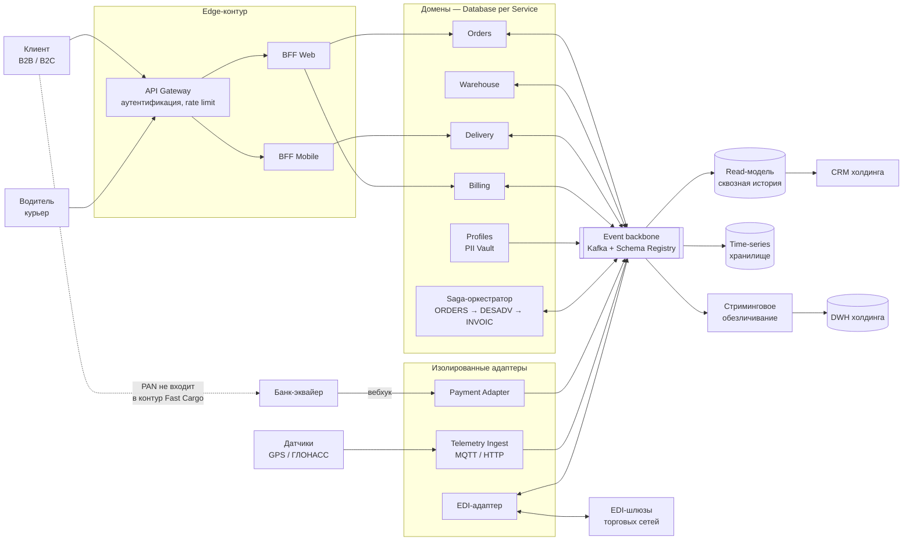

# План архитектурной трансформации ИТ-ландшафта Fast Cargo

**Документ:** План архитектурной трансформации (Architecture Transformation Plan)
**Версия:** 1.0 · **Автор:** Solution Architect · **Горизонт планирования:** 12 месяцев, с контрольной точкой на 3-м месяце

---

## 1. Выгоды бизнеса

- **Сделка со «Продуктами с душой» перестаёт быть заблокированной технически.** Глубокая интеграция ИТ — закрывающее условие слияния, поэтому трансформация здесь не инфраструктурная статья расходов, а прямой доступ к товарообороту крупнейшего ритейл-холдинга страны.
- **Готовность к десятикратному росту без десятикратного роста затрат.** Целевой профиль в 500 тысяч отправлений в сутки достигается горизонтальным масштабированием только нагруженных доменов, а не полным клонированием монолита вместе с его базой.
- **Простои, которые сегодня стоят выручки, уходят из процесса.** Ежемесячное закрытие периода в модуле «Финансы» больше не блокирует регистрацию заказов. Целевые 99,95% означают потолок недоступности около 4,4 часа в год вместо нынешних неконтролируемых окон.
- **Ноль потерянных платёжных вебхуков.** Исчезают ручные сверки по наложенным платежам и кассовые разрывы, когда деньги получены курьером, а в системе заказ висит неоплаченным.
- **Комплаенс превращается из риска в предсказуемую процедуру.** Физическая изоляция персональных данных и вывод карточных данных за пределы контура компании снимают угрозу оборотных штрафов по ФЗ-152 и сокращают объём ежегодного аудита PCI DSS до упрощённой анкеты.
- **Скорость поставки изменений.** Релиз отдельного домена вместо релиза всего монолита сокращает цикл с двух с лишним недель до дней и снимает взаимную блокировку команд.

---

## 2. Базовая и целевая архитектура

### 2.1. AS-IS и главный антипаттерн

Сегодня фронт-офис, самописный шлюз на FastAPI и монолитный бэкенд из четырёх логических модулей работают поверх одного физического инстанса PostgreSQL. Взаимодействие внутри бэкенда — синхронные in-process вызовы по цепочке, наружу — синхронное проксирование запросов через шлюз.

**Главный антипаттерн — Shared Database.** Все домены живут в одной схеме `operational` и связаны жёсткими ссылочными ограничениями. Это корневая причина, а не одна из четырёх проблем аудита: тяжёлые отчётные JOIN-запросы «Финансов» берут блокировки на транзакционных таблицах и останавливают приём заказов и запись координат; шлюз выжигает воркеров в ожидании ответа бэкенда, который сам ждёт СУБД, и отдаёт 504 с потерей банковских вебхуков; любая правка схемы под один домен требует регресса всего монолита.

Вторичный, но самостоятельный антипаттерн — **God Object BFF**: единый слой обслуживает и веб-кабинет, и мобильное приложение водителей, поэтому изменение вёрстки личного кабинета способно сломать API маршрутных листов.

### 2.2. TO-BE и ключевые паттерны взаимодействия

| Паттерн | Какую задачу целевой архитектуры он закрывает |
|---|---|
| **Event-Driven Architecture** на Kafka как единая шина событий | Убирает синхронную сцепку доменов. Деградация склада или биллинга не останавливает приём заказов и запись телеметрии — события копятся в брокере и обрабатываются после восстановления |
| **Database per Service** | Каждый домен владеет своей схемой и своим хранилищем. Междоменные JOIN-запросы и распределённые блокировки СУБД становятся физически невозможными |
| **Transactional Outbox** | Атомарность «запись в свою БД + публикация события» без двухфазного коммита. Гарантирует, что событие не потеряется и не опубликуется без сохранённого состояния |
| **Saga** (оркестрация для цепочки коммерческих документов) | Сквозная обработка ORDERS → DESADV → INVOIC с компенсирующими транзакциями. Исключает аномалии вида «счёт оплачен, товара на складе нет» при сетевых таймаутах |
| **BFF per client** за общим API Gateway | Развязывает контракты веб-кабинета и мобильного приложения. Релизы фронтов перестают влиять друг на друга |
| **CQRS + материализованная read-модель** | CRM холдинга получает сквозную историю заказов и перемещений из отдельной проекции, а не из транзакционной базы |
| **PII Vault** (выделенный домен профилей) | Паспорт, телефон и e-mail живут в изолированном контуре, наружу уходит только обезличенный идентификатор |
| **Strangler Fig** | Механика перехода: домены вырезаются из монолита по одному, трафик переключается на уровне Gateway, монолит демонтируется последним |

---

## 3. Область применения

### Входит в проект (in-scope)

- **Приложения Fast Cargo:** декомпозиция монолита на домены заказов, склада, доставки и биллинга; выделение домена профилей под персональные данные; разделение единого BFF на веб- и мобильный.
- **Интеграционный слой:** замена самописного шлюза на API Gateway с асинхронным приёмом вебхуков; развёртывание шины событий со схемным реестром.
- **Данные:** разделение схемы `operational` по принципу Database per Service; контур аналитики на CDC; отдельное хранилище телеметрии; read-модель для CRM.
- **Новые интеграционные контуры на стороне Fast Cargo:** EDI-адаптер коммерческих документов, приём потока телематики, платёжный адаптер, публикация обезличенного потока в DWH холдинга.
- **Эксплуатация:** наблюдаемость, CI/CD под независимые релизы доменов, эксплуатационная документация и архитектурные решения в формате, принятом архитектурным штабом.

### Не входит в проект (out-of-scope)

- **Внутренние системы холдинга.** DWH, CRM и корпоративная ERP остаются неизменяемыми. Fast Cargo отвечает за свою сторону контракта и за доставку данных до согласованной точки приёма, но не за модель данных и доработки на стороне холдинга.
- **Контур банка-эквайера.** Процессинг, хранение и обработка данных карт остаются зоной ответственности провайдера. Fast Cargo сознательно не берёт на себя PCI DSS-обязательства уровня хранения PAN.
- **Системы и процессы торговых сетей.** Форматы и транспорт EDI принимаются как заданные внешние стандарты.
- **Внешние справочники и подрядчики.** ФИАС, бухгалтерия, юридическое сопровождение и транспортные подрядчики остаются на текущей модели аутсорсинга.
- **Продуктовые изменения.** Редизайн интерфейсов, новые тарифные модели, ML-прогнозирование маршрутов и любая функциональность, не вытекающая из требований слияния.
- **Реорганизация физической логистики.** Складские процессы, автопарк и топология ЦОД холдинга не пересматриваются в рамках этого проекта.
- **Правка исходного кода легаси-монолита в первые три месяца.** Зафиксировано отдельным ограничением ниже.

---

## 4. Ограничения и допущения

### Ограничения

- **Сроки.** Три месяца на контур аналитики в реальном времени, двенадцать месяцев на полный демонтаж монолита. Даты закрытия сделки не сдвигаются, поэтому объём в фазах подрезается, а вехи — нет.
- **Заморозка легаси-кода в фазе 1.** На горизонте трёх месяцев любые изменения в исходном коде монолита и любая дополнительная SQL-нагрузка на его базу запрещены. Это ограничение полностью определяет выбор паттерна в разделе 6.
- **Информационная безопасность.** Персональные данные обрабатываются и хранятся на территории РФ в соответствии с ФЗ-152; платёжный контур проектируется под сценарий без попадания PAN в инфраструктуру компании; каналы и средства защиты подбираются из числа сертифицированных по ГОСТам РФ; прямой сетевой доступ внешних систем к транзакционной базе запрещён на уровне сегментации.
- **Технологический стек.** Приоритет Open Source с обязательным обоснованием перед архитектурным штабом по совокупной стоимости владения и рискам вендор-лока. Коммерческое ПО допускается только там, где требуется сертификация.
- **Инфраструктура и бюджет.** Контуры с персональными и платёжными данными размещаются On-Premise в ЦОД холдинга, остальные — в managed-облаке. Капитальные затраты фазы 1 ограничены утверждённым бюджетом квартала, наращивание ФОТ — платформенной командой из трёх человек.
- **Компетенции.** Текущая команда загружена операционной поддержкой, поэтому архитектурная функция и платформенные работы выносятся отдельным ресурсом, а не распределяются по действующим разработчикам.

### Допущения

- Действующий PostgreSQL поддерживает логическую репликацию, а инженерная команда может изменить параметры инстанса и создать публикацию без правок прикладного кода.
- Холдинг предоставляет точку приёма данных в DWH, согласованную модель целевых сущностей и спецификации форматов EDI до начала соответствующих этапов.
- Между ЦОД Fast Cargo и холдинга есть выделенный канал с пропускной способностью и задержкой, достаточными для потоковой репликации.
- Действующая утилизация ресурсов ЦОД позволяет разместить реплику базы и кластер брокера без закупки нового оборудования в фазе 1.
- Владельцы доменов со стороны бизнеса выделены и участвуют в согласовании границ сервисов.

---

## 5. Transition Architecture: тактический план на три месяца

| Уровень архитектуры | Текущее состояние (AS-IS) | Переходное состояние (через три месяца) | Обнаруженный разрыв (GAP) и локация изменений |
|---|---|---|---|
| **Данные (Data)** | Аналитические и отчётные запросы идут напрямую в операционную базу. Тяжёлые JOIN-запросы модуля «Финансы» берут блокировки на транзакционных таблицах и тормозят создание заказов и запись координат | Изменения вычитываются асинхронно из журнала предзаписи (WAL) без единого SELECT к транзакционным таблицам. Поток событий по заказам, отгрузкам и счетам доставляется в DWH холдинга с задержкой менее пяти секунд. Персональные данные маскируются до выхода из контура | **Разрыв:** нет выделенного контура аналитики, транзакционная и аналитическая нагрузки конкурируют за одни страницы данных.  **Локация:** слой хранения — включение логического уровня журналирования, публикация на пять ключевых таблиц, слот репликации, горячая реплика для чтения; развёртывание CDC-инструмента и потокового обезличивания |
| **Приложения (Apps)** | Монолит с четырьмя логическими модулями и общим BFF. Шлюз на FastAPI синхронно проксирует весь трафик, при росте нагрузки на СУБД исчерпывает воркеров и теряет банковские вебхуки по таймауту 504 | Код монолита не изменён ни на строку: контур аналитики подключён снаружи, на уровне журнала базы. Шлюз переведён на асинхронный приём вебхуков — подтверждение выдаётся сразу после записи события в брокер, обработка идёт отдельным консьюмером. Начато разделение BFF на веб- и мобильный контуры | **Разрыв:** между внешним миром и монолитом нет буфера, поэтому отказ бэкенда напрямую превращается в потерю входящих сообщений; контракты разных клиентов не изолированы.  **Локация:** интеграционный слой — шлюз и адаптер вебхуков; фронт-офис — выделение второго BFF. Монолит остаётся неприкосновенным |
| **Инфраструктура (Infra)** | Один физический инстанс PostgreSQL без реплик как единая точка отказа. Нет брокера сообщений, нет сквозной наблюдаемости, стенд для нагрузочных проверок отсутствует | Горячая реплика базы в отдельной стойке, кластер брокера из трёх узлов с реестром схем, отдельный сегмент сети под аналитический контур, метрики и алерты по задержке репликации и лагу консьюмеров, стенд, повторяющий продуктивную конфигурацию | **Разрыв:** нет отказоустойчивости хранилища, нет транспорта событий и нет измеримости — без метрик невозможно подтвердить SLA в пять секунд перед архитектурным штабом.  **Локация:** ЦОД — резервирование узлов под реплику и брокер; платформа — мониторинг, сегментация, staging-контур |

---

## 6. Описание переходного состояния: как получить аналитику за пять секунд, не трогая монолит

**Выбранный паттонн — Log-based Change Data Capture поверх журнала предзаписи PostgreSQL с доставкой через шину событий.** Коннектор подписывается на слот логической репликации, декодирует WAL в поток изменений по строкам, публикует их в топики брокера, откуда sink-коннектор загружает данные в DWH холдинга микропакетами.

Почему именно этот паттерн, а не альтернативы:

- **Опрос таблиц по метке времени** отпадает сразу: это и есть дополнительная SELECT-нагрузка на операционную базу, прямо запрещённая ограничением фазы 1.
- **Transactional Outbox**, правильный паттерн для целевой архитектуры, в переходном состоянии неприменим: он требует, чтобы код монолита писал события в таблицу исходящих сообщений в той же транзакции.
- **Триггеры на таблицах** формально не меняют прикладной код, но удлиняют транзакции и добавляют запись в горячий путь — то есть ухудшают ровно ту характеристику, которую мы защищаем.
- **Log-based CDC** не участвует в транзакциях вообще. Он читает уже зафиксированный журнал, то есть архитектурно не способен ни заблокировать таблицу, ни замедлить коммит. Это единственный вариант, одновременно удовлетворяющий обоим запретам.

Технические решения и их обоснование:

- **Публикация ограничена пятью таблицами** операционной схемы, нужными DWH. Узкая публикация снижает объём декодирования и не даёт контуру аналитики разрастись в неявную реплику всей базы.
- **Слот репликации выносится на горячую реплику**, если версия СУБД это позволяет; иначе слот остаётся на основном узле, а накладные расходы удерживаются узкой публикацией и контролируются метрикой роста процессорного времени. Допустимый прирост зафиксирован в критериях приёмки.
- **Обезличивание выполняется в потоке**, до выхода данных из контура Fast Cargo. Паспорт, телефон и e-mail заменяются устойчивым псевдонимом ещё в конвейере, поэтому в DWH персональные данные не попадают физически, а не «по договорённости».
- **Реестр схем и контракты событий** фиксируют формат, поэтому изменение структуры таблицы в монолите не ломает загрузку в DWH молча, а отклоняется на этапе валидации схемы.
- **Брокер как буфер** даёт устойчивость к плановым работам на стороне DWH: при недоступности приёмника события сохраняются в топиках и догружаются после восстановления без потери и без обратного давления на операционную базу.

**Бюджет задержки при целевом значении в пять секунд** распределяется так: фиксация транзакции и сброс журнала — десятки миллисекунд; декодирование и чтение коннектором — до 0,5 секунды; публикация и репликация в брокере — до 0,2 секунды; формирование микропакета sink-коннектором — 1 секунда; загрузка и фиксация в DWH — до 1,5 секунды. Расчётная задержка по 95-му процентилю укладывается в 3 секунды, оставляя около 2 секунд резерва на сетевые всплески.

---

## 7. Дорожная карта, риски и план перехода

### 7.1. Пакеты работ и сроки

- **Недели 1–3. Инфраструктурный фундамент.** Разворачиваем горячую реплику базы, кластер брокера с реестром схем, мониторинг и staging-контур. Зона ответственности — платформенная команда и инженер эксплуатации Fast Cargo при согласовании квот с производственно-инфраструктурным департаментом холдинга.
- **Недели 3–6. CDC-контур и контракты данных.** Включаем логическое журналирование, создаём публикацию и слот, поднимаем коннектор, согласуем с холдингом модель целевых сущностей и правила обезличивания. Ответственные — архитектор решения, инженер данных и аналитики Fast Cargo совместно с командой DWH и департаментом информационной безопасности.
- **Недели 6–9. Доставка в DWH и сверка.** Подключаем sink-коннектор, настраиваем ежедневную сверку полноты, проводим нагрузочное тестирование на профиле пиковой записи. Ответственные — инженер данных Fast Cargo и команда DWH холдинга, приёмка со стороны операционного блока.
- **Недели 9–12. Стабилизация и передача в эксплуатацию.** Переводим приём банковских вебхуков на асинхронную схему, прогоняем аварийные сценарии, пишем эксплуатационные регламенты и архитектурные решения для защиты перед архитектурным штабом. Ответственные — группа разработки, эксплуатация и техлид Fast Cargo.

### 7.2. Управление рисками и план откáта

- **Неконтролируемый рост слота репликации.** Если приёмник данных остановлен, журнал перестаёт очищаться и способен заполнить диск основного узла — то есть остановить отгрузки. Смягчение: ограничение объёма удерживаемого журнала на уровне конфигурации СУБД, алерт по заполнению диска на 60% и по лагу слота. Откат: отключение коннектора и удаление слота — операция в одну команду, монолит и приём заказов не затрагиваются.
- **Рост нагрузки на основной узел от декодирования журнала.** Смягчение: узкая публикация, вынос слота на реплику, ограничение скорости коннектора. Откат: приостановка коннектора без удаления слота, если деградация краткосрочная, либо полное отключение контура при устойчивом превышении порога по процессорному времени.
- **Разрыв непрерывности при переключении вебхуков банка.** Смягчение: параллельная работа старого синхронного и нового асинхронного путей под управлением признака функциональности, канареечное включение на 5%, затем 50% и 100% трафика. Откат: возврат признака в исходное положение занимает минуты и не требует деплоя.
- **Расхождение данных между базой и DWH.** Смягчение: доставка минимум один раз в сочетании с идемпотентными ключами на стороне приёмника, ежедневная сверка количества записей и контрольных сумм по ключевым сущностям. Откат: повторная инициализация топика со снимка нужных таблиц, снятого с реплики.

Принципиальная особенность выбранного решения в части рисков: контур аналитики работает в режиме только чтения и вне транзакционного пути, поэтому любой откат — это выключение внешнего компонента, а не обратная миграция данных или обратный деплой монолита.

### 7.3. Критерии успешности и переключение

- **Численные критерии приёмки.** Сквозная задержка от фиксации транзакции до появления строки в DWH — не более 5 секунд по 95-му процентилю и не более 10 секунд по 99-му. Ноль дополнительных SELECT-запросов к операционной схеме, подтверждённый статистикой запросов СУБД. Прирост процессорного времени на основном узле — не более 5%. Задержка репликации — не более 2 секунд. Полнота данных — 100% по суточной сверке. Ноль изменений в репозитории монолита, подтверждённых сравнением ветки релиза.
- **Порядок безопасного ввода в эксплуатацию.** Сначала полный прогон на staging-контуре с воспроизведением пикового профиля записи. Затем теневой режим на продуктивной среде: данные идут в брокер и DWH, но не используются для отчётности, а только сверяются с эталоном. Далее канареечное включение на одной сущности — заказах, с расширением на остальные таблицы публикации после двух недель стабильной работы. Только после этого отключаются действующие отчётные выгрузки из операционной базы.
- **Условия закрытия фазы.** Наблюдение показателей в течение двух недель без нарушения порогов, подписанная приёмка со стороны департамента информационной безопасности по правилам обезличивания и передача контура на поддержку с готовым регламентом действий при отказе.
