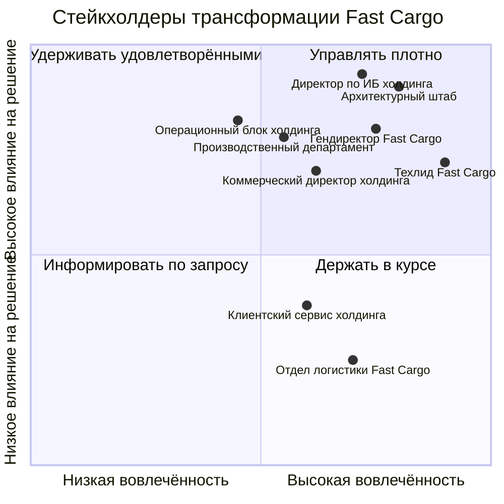

# Матрица стейкхолдеров трансформации Fast Cargo

**Версия:** 1.0   
**Автор:** Solution Architect  
**Опорный документ**: «План архитектурной трансформации» (Task1)

---

## 1. Как расставлены приоритеты

Требования отранжированы по тому, что произойдёт, если требование не закрыть:

- **Critical** - требование блокирует закрытие сделки, создаёт юридический риск или ломает непрерывность операций. Обходного пути нет, срок - фаза 1 или ближайшая веха.
- **Medium** - требование влияет на целевые метрики года, но на переходный период у него есть обходной путь без потерь для бизнеса.
- **Low** - требование улучшает эксплуатацию и удобство работы команд, его перенос за горизонт года не создаёт риска.

Строки в таблице идут в порядке убывания приоритета.

---

## 2. Расширенная матрица стейкхолдеров

| Роль / стейкхолдер | Архитектурное требование | Приоритет требования | Оценка влияния на ИТ-ландшафт | Главное опасение / риск стейкхолдера | Как целевая архитектура закрывает требование |
|---|---|---|---|---|---|
| **Директор по информационной безопасности холдинга «Продукты с душой»** | Физически изолировать персональные данные клиентов по ФЗ-152 и отдавать во внешнюю аналитику только обезличенные данные | Critical | Высокое: поля персональных данных выносятся из общей схемы в отдельное хранилище, перестраивается модель доступа для внешних систем | Утечка при подключении CRM холдинга напрямую к легаси-базе, предписание регулятора и оборотный штраф | • Домен профилей как PII Vault: отдельная БД в выделенном сетевом сегменте, операционные домены хранят только псевдоним клиента и не содержат полей персональных данных  • Прямой сетевой доступ внешних систем к транзакционным базам закрыт сегментацией, CRM читает CQRS-проекцию через API  • Поток в DWH проходит стриминговое обезличивание до выхода из контура Fast Cargo |
| **Директор по информационной безопасности холдинга «Продукты с душой»** | Изолировать платёжный контур так, чтобы данные карт не попадали в инфраструктуру Fast Cargo | Critical | Среднее: затрагивает фронт оплаты и новый адаптер, транзакционное ядро не меняется | Расширение области аудита PCI DSS на весь ландшафт компании и срыв подключения новых платёжных сценариев холдинга | • Оплата через редирект или безопасный виджет банка-эквайера, реквизиты карты вводятся на его стороне  • Payment Adapter принимает только вебхуки о статусе платежа и токен, PAN в контур не поступает  • Платёжный адаптер в отдельном сегменте, область аудита сводится к упрощённой анкете |
| **Генеральный директор Fast Cargo - спонсор трансформации** | Через три месяца обеспечить аналитику в DWH холдинга с задержкой не более пяти секунд, без правок кода монолита и без SQL-нагрузки на его базу | Critical | Высокое: появляются новый транспорт событий и контур аналитики, при нулевом вмешательстве в приложение | Сорвать первую веху перед холдингом и потерять позицию равного партнёра в сделке | • Log-based CDC поверх журнала предзаписи: коннектор читает WAL, публикует изменения в брокер, sink-коннектор грузит их в DWH микропакетами  • Расчётная задержка около трёх секунд при лимите пять, бюджет разложен по участкам конвейера  • Монолит не затронут, контур отключается одной командой |
| **Бизнес-заказчик - коммерческий директор холдинга, владелец контура работы с торговыми сетями** | Сквозной автоматический обмен документами ORDERS, DESADV и INVOIC со всеми сетями холдинга в реальном времени с жёстким SLA | Critical | Высокое: новый EDI-адаптер, событийные контракты документов и их версионирование | Простой отгрузок в сеть из-за непринятого документа и штрафы по договору поставки | • EDI-адаптер как изолированный сервис на шине событий, документы публикуются событиями с контрактом в реестре схем  • Недоступность приёмника не блокирует отгрузку: документ ждёт в топике и досылается после восстановления  • Статус каждого документа прослеживается сквозным идентификатором на всей цепочке |
| **Архитектурный штаб холдинга** | Гарантировать итоговую согласованность цепочки документов без распределённых блокировок СУБД и междоменных JOIN-запросов | Critical | Высокое: разделение данных по принципу Database per Service и перевод межмодульных вызовов на события | Получить распределённый монолит: домены формально разделены, но связаны через общую базу, а в цепочке возможна оплата счёта при отсутствии товара | • Saga с оркестрацией на цепочке ORDERS → DESADV → INVOIC и компенсирующими шагами вместо распределённой транзакции  • Transactional Outbox даёт атомарность записи в свою БД и публикации события  • Каждый домен владеет своим хранилищем, поэтому междоменный JOIN невозможен физически, а не запрещён регламентом |
| **Производственно-инфраструктурный департамент холдинга** | Принимать до трёх тысяч запросов в секунду на запись телеметрии без потери геоданных и без влияния на создание заказов | Critical | Высокое: отдельный путь приёма, профильное хранилище и новые мощности в ЦОД | Поток телематики положит СУБД и вместе с ней всю операционную деятельность | • Телеметрия не пишется в операционную базу: датчики отдают данные в сервис приёма, тот только публикует их в брокер и подтверждает получение  • Брокер работает амортизатором: партиционирование по транспортному средству даёт линейное масштабирование, буфер поглощает пики, при отставании потребителя растёт лаг, а не теряются точки  • Координаты складываются в time-series хранилище, разведённое с заказами по разным БД |
| **Операционный блок холдинга** | Держать доступность ядра не ниже 99,95% в круглосуточном режиме при нулевых потерях ответов платёжных шлюзов по таймауту | Critical | Высокое: требует резервирования хранилища, асинхронного приёма вебхуков и сквозной наблюдаемости | Отгрузки встают, деньги, полученные курьером, не привязываются к заказу, растёт объём ручной сверки | • Асинхронный приём вебхуков: подтверждение выдаётся сразу после записи события в брокер, обработка идёт отдельным консьюмером, поэтому таймаут бэкенда больше не теряет сообщение  • Горячая реплика базы и кластер брокера убирают единые точки отказа  • Соблюдение SLA подтверждается панелью метрик, а не экспертной оценкой |
| **Техлид Fast Cargo** | Сохранить непрерывность текущих отгрузок и не переписывать легаси-код в фазе 1 | Critical | Высокое по зоне риска и нулевое по вмешательству в код: изменения идут вокруг монолита, а не внутри него | Новый контур поломает работающий монолит, а команда получит одновременно поддержку легаси и незнакомый стек | • CDC работает только на чтение и вне транзакционного пути, критерий приёмки - ноль изменённых строк в репозитории монолита  • Откат сводится к выключению внешнего коннектора, без обратного деплоя и обратной миграции данных  • Демонтаж по Strangler Fig: домены выносятся по одному с канареечным переключением трафика на Gateway |
| **Архитектурный штаб холдинга** | Соответствие фреймворкам корпоративной архитектуры, отсутствие дублирования функций и обоснование выбора Open Source против коммерческого ПО | Medium | Среднее: влияет на процесс принятия решений и документацию, а не на поведение системы в рантайме | Стихийный набор технологий, который холдинг не сможет стандартизировать и поддерживать после слияния | • Целевая архитектура описана по слоям TOGAF с каталогом доменов и явными владельцами, что исключает дублирование функций  • Каждое решение фиксируется ADR с разобранными альтернативами и причиной отказа от них  • Приоритет Open Source с расчётом совокупной стоимости владения, коммерческое ПО только там, где нужна сертификация |
| **Производственно-инфраструктурный департамент холдинга** | Определить размещение контуров между On-Premise и managed-облаком и бюджет эксплуатации на пиковых нагрузках | Medium | Среднее: определяет топологию развёртывания и стоимость владения, логику приложений не меняет | Неконтролируемый рост счёта за инфраструктуру и нехватка мощностей ЦОД в пиковые периоды | • Контуры с персональными и платёжными данными размещаются On-Premise в ЦОД, остальное - в managed-облаке  • Масштабируются только нагруженные домены, а не монолит вместе с его базой  • Фаза 1 укладывается в текущую утилизацию ЦОД без закупки оборудования |
| **Операционный блок холдинга** | Масштабирование до 500 тысяч отправлений в сутки и 200 запросов в секунду на создание заказов с подтверждённым экономическим эффектом | Medium | Высокое на горизонте года, но фазу 1 не блокирует: текущие объёмы ландшафт пока держит | Инвестиции в трансформацию не окупятся, а переходный период обойдётся дороже, чем прирост выручки | • Независимое горизонтальное масштабирование доменов заказов и доставки под их собственный профиль нагрузки  • Развязка через шину снимает деградацию по цепочке, поэтому пик в одном домене не растекается на остальные  • Эффект считается на разнице между стоимостью контура и выручкой от подключённых сетей холдинга |
| **Техлид Fast Cargo** | Автономность релизов: изменение в одном домене не должно требовать регресса всего ландшафта | Medium | Высокое: требует разделения кодовой базы, контрактного тестирования и отдельных пайплайнов | Релизный цикл останется двухнедельным, команды продолжат блокировать друг друга, а нагрузка на поддержку вырастет | • Разделение BFF по типам клиентов снимает связку веб-кабинета и мобильного приложения водителей  • Database per Service и контракты событий в реестре схем позволяют деплоить домен независимо  • Сквозной регресс заменяется контрактными тестами в пайплайне каждого домена |
| **Руководитель клиентского сервиса холдинга - владелец омниканальной CRM** | Мгновенный доступ чат-ботов и операторов к сквозной истории заказов, перемещений и профилей клиентов | Medium | Среднее: появляется новая проекция данных и API, транзакционные домены не меняются | Оператор не видит полной картины по клиенту, время обработки обращения растёт вместе с числом заказов | • CQRS-проекция собирает сквозную историю из событий доменов и отвечает на запросы CRM через API  • Контакты подтягиваются из PII Vault по псевдониму отдельным правом доступа, каждое обращение логируется  • Нагрузка от поддержки не конкурирует с оформлением заказов, так как читается отдельное хранилище |
| **Руководитель отдела логистики Fast Cargo** | Онлайн-видимость положения и состояния груза для построения и корректировки маршрутов | Low | Среднее: подразделение становится потребителем уже созданного потока телеметрии, новых контуров не требуется | Данные с датчиков будут приходить с задержкой, и маршруты станут строиться по устаревшей картине | • Домен доставки подписан на тот же поток телеметрии из брокера, что и аналитика, поэтому свежесть данных одинаковая  • Запросы по треку обслуживает time-series хранилище, не обращаясь к операционной базе  • Потеря связи с датчиком видна как лаг в брокере и попадает в алерт, а не обнаруживается по факту срыва доставки |

---

## 3. Карта влияния и вовлечённости

Тактика работы по квадрантам:

- **Управлять плотно.** Архитектурный штаб, директор по информационной безопасности, техлид Fast Cargo и генеральный директор одновременно и влияют на решение, и глубоко в нём разбираются. С ними работаем не презентациями, а артефактами: ADR с разобранными альтернативами, критерии приёмки с числами, подпись под выходом из теневого режима. Техлид - отдельный случай: он единственный, кто может заблокировать проект изнутри, поэтому его нужно сделать владельцем порогов приёмки, а не получателем решения.
- **Удерживать удовлетворёнными.** Операционный блок и производственно-инфраструктурный департамент имеют высокое влияние, но погружаться в детали не будут. Им нужны две вещи: расчёт мощностей с политикой хранения данных и план отката, показывающий, что переходный период не угрожает отгрузкам.
- **Держать в курсе.** Коммерческий директор и клиентский сервис холдинга - основные выгодоприобретатели. С ними обсуждаем не архитектуру, а сроки появления функциональности: когда заработает обмен документами с сетями и когда операторы получат сквозную историю.
- **Информировать по запросу.** Отдел логистики Fast Cargo получает выгоду автоматически, как потребитель потока телеметрии, и отдельного согласования не требует.
